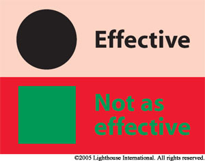
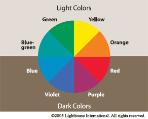
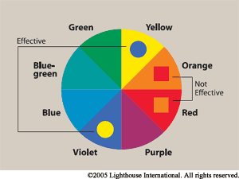
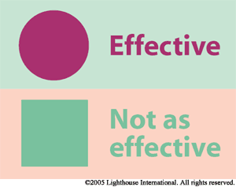
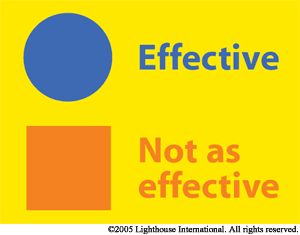

# Effective colour contrast

This page contains three basic guidelines for making effective color choices that work for nearly everyone. It is a partial copy of a brochure on effective colour contrast by the ["Lighthouse International" charity](http://www.lighthouseguild.org/). The original brochure no longer exists on the Lighthouse International website, but a [full reproduction is available](http://www.cs.mtu.edu/~nilufer/classes/cs3611/interesting-stuff/designing-with-colors-1/color_contrast.htm).

## How does impaired vision affect color perception?

Partial sight, aging and congenital color deficits all produce changes in perception that reduce the visual effectiveness of certain color combinations. Two colors that contrast sharply to someone with normal vision may be far less distinguishable to someone with a visual disorder. It is important to appreciate that it is the contrast of colors one against another that makes them more or less discernible rather than the individual colors themselves. Here are three simple rules for making effective color choices:

## The three rules

### Exaggerate lightness differences between foreground and background colors, and avoid using colors of similar lightness adjacent to one another, even if they differ in saturation or hue.

Dont assume that the lightness you perceive will be the same as the lightness perceived by people with color deficits. You can generally assume that they will see less contrast between colors than you will. If you lighten the light colors and darken the dark colors in your design, you will increase its visual accessibility.

### Choose dark colors with hues from the bottom half of this hue circle against light colors from the top half of the circle.

Avoid contrasting light colors from the bottom half against dark colors from the top half.

For most people with partial sight and/or congenital color deficiencies, the lightness values of colors in the bottom half of the hue circle tend to be reduced.

### Avoid contrasting hues from adjacent parts of the hue circle, especially if the colors do not contrast sharply in lightness.

Color deficiencies associated with partial sight and congenital deficiencies make it difficult to discriminate between colors of similar hue.

